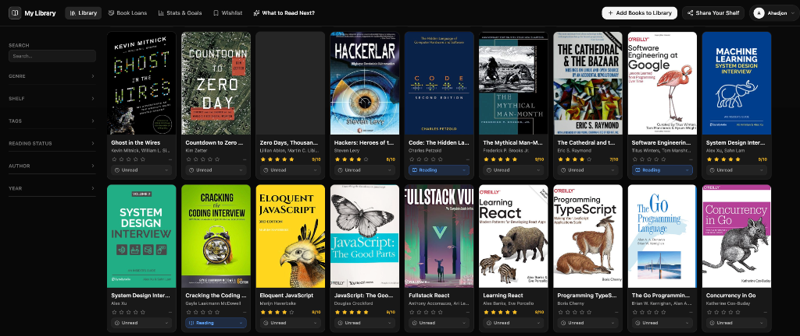
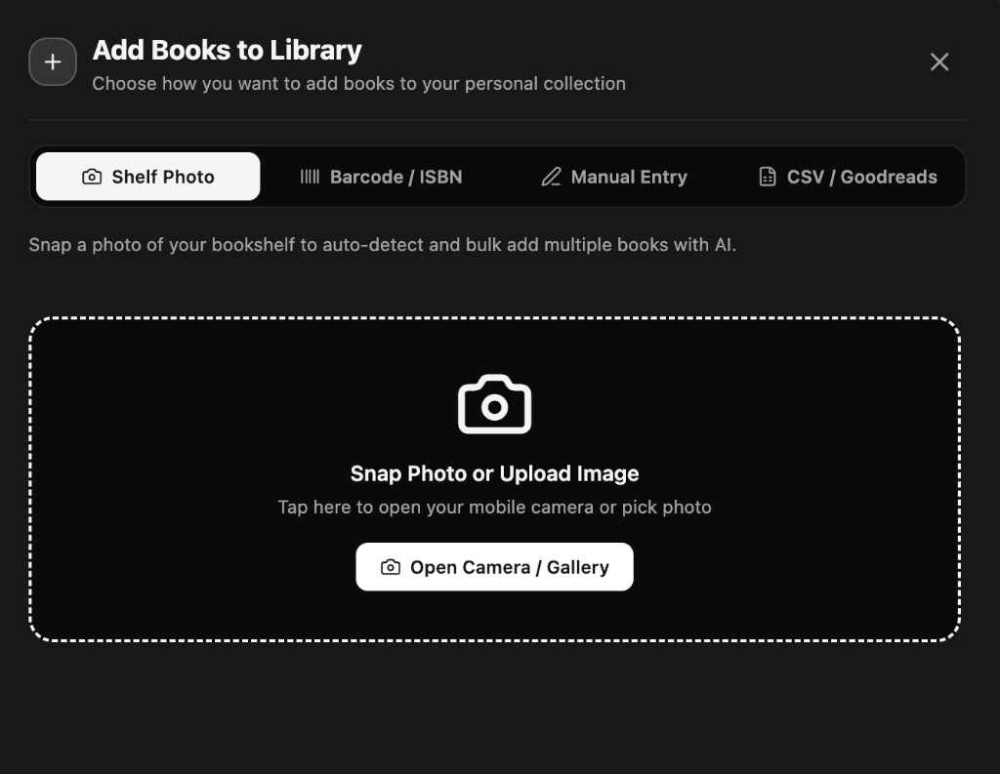
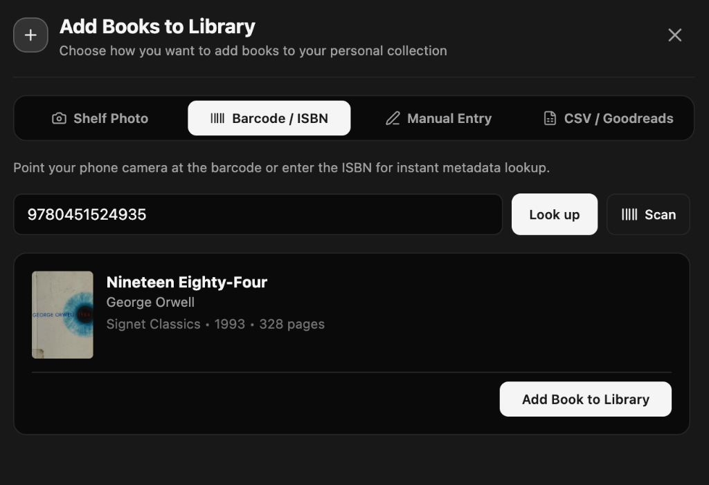
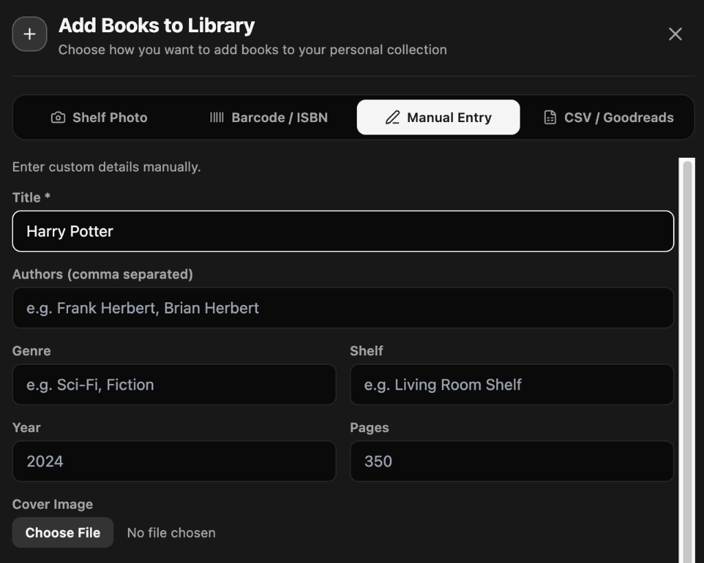
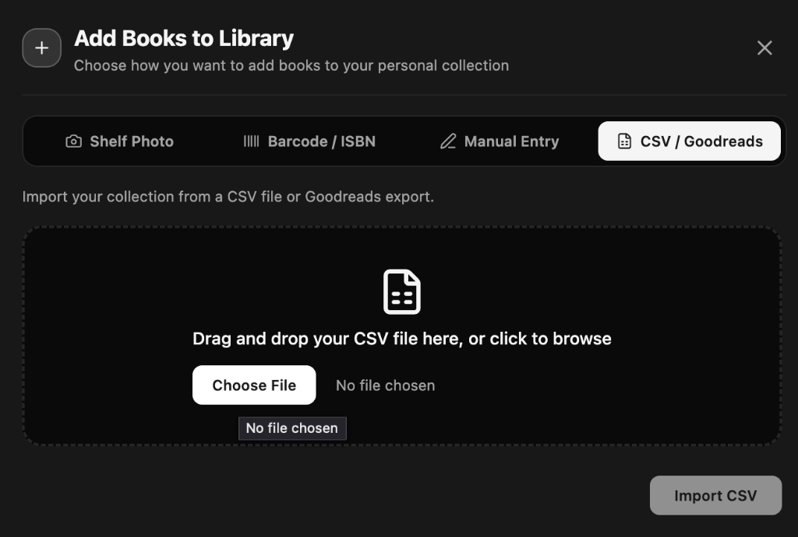

# 📖 Book Library — User Guide & Quick Start

Welcome to your personal and household **Book Library**! Whether you have 20 books or 2,000, this app helps you catalog your physical collection, track what you are reading, lend books to friends without losing them, and decide what to read next.

---

## 📑 Table of Contents
1. [Viewing & Exploring Your Library](#1-viewing--exploring-your-library)
2. [Adding Books (4 Fast Ways)](#2-adding-books-4-fast-ways)
3. [Tracking Your Reading Progress & Ratings](#3-tracking-your-reading-progress--ratings)
4. [Sharing with Family & Roommates (Household Library)](#4-sharing-with-family--roommates)
5. [Lending Tracker — Never Lose a Book](#5-lending-tracker--never-lose-a-book)
6. [Reading Goals & Personal Stats](#6-reading-goals--personal-stats)
7. [AI "What to Read Next?" Assistant](#7-ai-what-to-read-next-assistant)
8. [Public Shareable Profile](#8-public-shareable-profile)
9. [Importing & Exporting Your Data](#9-importing--exporting-your-data)
10. [Changing Language (English / O'zbek)](#10-changing-language)

---

## 1. Viewing & Exploring Your Library



You can view and browse your collection in two ways:

### 🖼️ Gallery View (Visual Grid)
Displays your books as cards with high-resolution cover art. Directly on any book card:
- Click the **Status Badge** (e.g. `⏳ Unread ▾`) to instantly mark it as `📖 Reading` or `✅ Finished`.
- Click the **Stars (★)** to rate the book from 1 to 10 without leaving the page.

### 📋 Table View (Spreadsheet Style)
Perfect for quickly sorting your library by **Author**, **Publication Year**, **Page Count**, or **Shelf Location**.

---

### 🏷️ Shelves & Tags (Finding Where Books Are)
- **Shelves**: Physical locations in your home (e.g., *"Living Room Shelf A"*, *"Bedside Table"*, *"Office Desk"*).
- **Tags**: Themes, topics, or genres (e.g., *"Favorites"*, *"Sci-Fi"*, *"Clean Code"*, *"Gift"*).
- Use the **Filter Sidebar** on the left to instantly filter books by genre, shelf, or author with one click.

---

## 2. Adding Books (4 Fast Ways)

Click the **`+ Add Books to Library`** button in the top navigation bar to open the add modal:

---

### 📸 Method A: Take a Photo of Your Bookshelf
Got a full shelf of books? You don't need to type them one by one.



1. Select the **Shelf Photo** tab.
2. Snap or upload a photo of your physical bookshelf.
3. The AI reads the book spines, finds cover art, authors, and page counts automatically.
4. Review the detected list and click **Add Selected Books**.

---

### 📷 Method B: Scan Barcode or Look Up by ISBN
Have a book in your hand?



1. Select the **Barcode / ISBN** tab.
2. Click **Scan** to point your phone or webcam camera at the barcode on the back cover.
3. Or type the **ISBN** (the 10 or 13-digit number) and click **Look up**.
4. The title, author, publisher, cover image, and page count will auto-populate instantly. Click **Add Book to Library**.

---

### ✍️ Method C: Manual Entry
For rare, vintage, or custom books without barcodes.



1. Select the **Manual Entry** tab.
2. Fill in the title, author(s), shelf, genre, and page count.
3. Optionally upload a custom cover photo and click **Add Book to Library**.

---

### 📁 Method D: CSV / Goodreads Import
Transfer your entire reading history from Goodreads or an Excel spreadsheet in one go.



1. Select the **CSV / Goodreads** tab.
2. Drag and drop your `.csv` file.
3. Click **Import CSV** — your books, ratings, and read dates will import in seconds.

---

## 3. Tracking Your Reading Progress & Ratings

Every book has a reading status:
- ⏳ **Unread**: Books waiting on your shelf.
- 📖 **Reading**: Currently reading.
- ✅ **Finished**: Completed books.
- 🛑 **Abandoned**: Books you decided not to finish.

### ⚡ 1-Tap Quick Actions
You don’t have to open a book detail page to update your progress:
- Click the **Status Badge** on the card to change your status.
- Click the **Star Rating (★)** on any card to rate it 1 to 10.

---

## 4. Sharing with Family & Roommates (Household Library)

Do you share your physical home library with your spouse, family, or roommate?

With **Household Libraries**, everyone shares the catalog of physical books, but maintains **independent reading progress and private ratings**:

```
                  ┌───────────────────────────────┐
                  │   🏡 Shared Home Bookshelf    │
                  │       (Physical Books)        │
                  └───────────────┬───────────────┘
                                  │
                 ┌────────────────┴────────────────┐
                 ▼                                 ▼
      👤 Ahadjon (Owner)                👤 Partner / Roommate
      • Reading: "1984"                 • Reading: "Clean Code"
      • Finished: 15 books              • Finished: 8 books
      • Rated: ★★★★★ 10/10              • Rated: ★★★★☆ 8/10
```

### How to Invite a Member:
1. Click your profile menu in the top right $\rightarrow$ **Household Library**.
2. Copy your **6-character Invite Code** or invite link.
3. Your family member creates an account and enters the code to join your library.

---

## 5. Lending Tracker — Never Lose a Book

Keep track of books you lend to friends or colleagues:

1. Go to the **Book Loans** tab in the top navigation.
2. Click **`+ Lend a Book`**.
3. Choose the book, enter your friend's name, contact details, and a return due date.
4. The book will display an orange **`On Loan`** badge across your library.
5. When returned, click **Mark as Returned** with 1 tap.

---

## 6. Reading Goals & Personal Stats

Stay motivated with your yearly reading challenge:

1. Go to the **Stats & Goals** tab.
2. Set your **Yearly Reading Goal** (e.g. *25 books in 2026*).
3. The app tracks your **Live Pace**:
   - 🟢 *"Ahead of schedule"*
   - 🟡 *"On track"*
   - 🔴 *"Behind pace"*
4. Explore visual charts of your reading pace, top genres, favorite authors, and total pages read.

---

## 7. AI "What to Read Next?" Assistant

Standing in front of your shelf wondering what to read?

1. Click the **`✨ What to Read Next?`** button in the top navigation.
2. Choose your vibe:
   - ⚡ *"Quick Weekend Read"* ($\le 200$ pages)
   - 🧠 *"Deep & Thoughtful"*
   - 🚀 *"Fast-Paced & Gripping"*
   - Or type a custom prompt (e.g., *"Inspiring biography"*).
3. The assistant searches your **unread books** and presents the top 3 recommendations with personalized reasons.

---

## 8. Public Shareable Profile

Want to show friends what books you own or recommend?

1. Click **`Share Your Shelf`** in the top navigation.
2. Toggle **Public Shelf** to `ON` and pick a custom username slug (e.g. `your-name`).
3. Share your link (`https://your-domain.com/share/your-name`).
4. Anyone can browse your shelf without creating an account or logging in.

---

## 9. Exporting Your Data

Click the **Export** button on the Table View to download your entire collection as an Excel (`.xlsx`) or CSV file anytime. **Your data is always 100% yours.**

---

## 10. Changing Language

Click your user menu in the top right to switch between:
- 🇬🇧 **English**
- 🇺🇿 **O'zbekcha**

All buttons, forms, and camera scanners update immediately to your chosen language.
